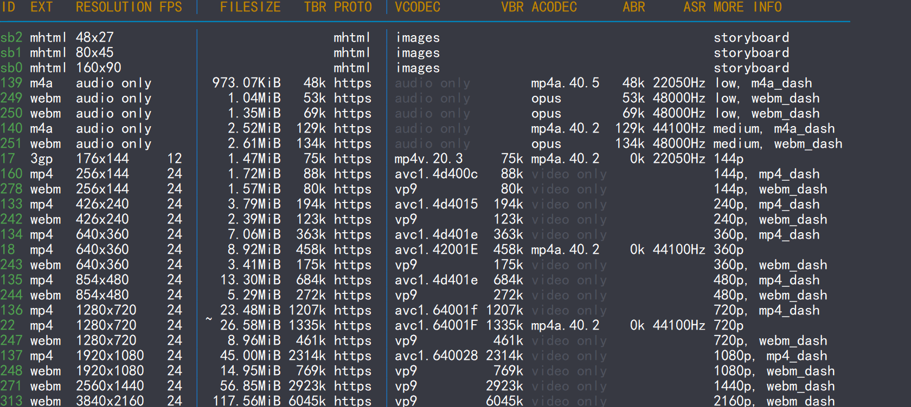

# 一、基本说明

> 本部分仅作原理说明，不想了解原理可直接跳转至操作步骤部分。

## 1. 用到的项目

1. [youtube-dl](https://github.com/ytdl-org/youtube-dl#format-selection)：下载YouTube视频的项目，但限速到70KB/s。
2. [yt-dlp](https://github.com/yt-dlp/yt-dlp)：youtube-dl的分叉，不限速度。本文使用此项目下载YouTube视频。
3. [FFmpeg](https://github.com/BtbN/FFmpeg-Builds)：被广泛使用的视频解码、视频转换开源程序。

## 2. 下载原理

yt-dlp能够解析YouTube视频链接，并提供下载编号，如下图：



可以看到，最高清的视频（最底下那几行）都是video only的，也就是没有声音。因此如果想要下载最高清的带声音视频，就需要使用FFmpeg这个程序将音频与视频进行融合。

## 3. 下载命令

以下是yp-dlp下载命令的一些实例，仅供参考。具体下载说明可参看[此链接](https://github.com/yt-dlp/yt-dlp#format-selection)。

```bash
# Download and merge the best video-only format and the best audio-only format,
# or download the best combined format if video-only format is not available
$ yt-dlp -f "bv+ba/b"

# Download best format that contains video,
# and if it doesn't already have an audio stream, merge it with best audio-only format
$ yt-dlp -f "bv*+ba/b"

# Same as above
$ yt-dlp

# Download the best video with the best extension
# (For video, mp4 > webm > flv. For audio, m4a > aac > mp3 ...)
$ yt-dlp -S "ext"
```


# 二、操作步骤

> 参考文章：https://zhuanlan.zhihu.com/p/36803432
>
> 本机为Windows，其他操作系统步骤类似。

## 1. 安装Python

略。

## 2. 安装youtube-dlp

安装Python后，在cmd界面输入pip install yt-dlp

> 如果失败了就输入pip install --upgrade yt-dlp试试

## 3. 安装FFmpeg

1. 从GitHub项目中下载[压缩包](https://github.com/BtbN/FFmpeg-Builds/releases)并解压至任意路径，最好是你的软件安装路径
2. 系统属性→高级→环境变量→系统变量·PATH，将解压目录的bin文件夹路径添加进入。在cmd中输入ffmpeg检查是否成功安装

## 4. 使用脚本下载视频

使用[此脚本](使用yt-dlp下载YouTube高清视频.assets/下载YouTube视频.bat)进行下载，脚本中将保存路径设置为D:\user\Downloads\YouTube，也可自行设置。脚本将自动下载最高清的mp4视频。

以下是脚本源码，有基础的同学也可以自行修改功能。其中`::`是全行注释符号，被注释的命令是要求用户在cmd窗口手动输入保存路径和下载视频编号的。注意，由于脚本中含有中文，因此文本格式需要保存为ANSI，否则可能出现乱码。

脚本中默认下载最清晰的MP4格式的视频，但yt-dlp获取的MP4格式的最高分辨率有时会低于WEBM格式的视频。可以将脚本中下载最清晰视频那句命令取消注释，从而获得最清晰视频（不一定为MP4格式）。

```bash
@echo off

:start

::下面一句是手动输入保存路径，此处将其注释，保存路径写死为D:\user\Downloads\YouTube
::set /p dir=请输入保存路径：
set dir=D:\user\Downloads\YouTube

::将dir中的/修改为\
set dir=%dir:/=\%

pushd %dir%

::判断路径是否合法
if /i not %dir%==%cd% goto :start

echo 保存路径：%cd%

:download

set /p input=请输入视频链接：
set input=%input:&=^^^&%

::查询下载列表，--proxy后面跟代理服务器地址，一般都是127.0.0.1跟上代理端口
yt-dlp -F %input% --proxy socks5://127.0.0.1:10808

if errorlevel 1 goto :download

::下面一句是手动输入视频格式编号，此处将其注释，默认选择最好的视频编号
::set /p code=请输入视频格式编号：
::根据视频格式编号下载
::yt-dlp -f %code% %input% --proxy socks5://127.0.0.1:10808

::Download the best mp4 video available, or the best video if no mp4 available
::下载最清晰的MP4格式视频+音频，如果没有MP4格式则下载其他格式的最清晰视频
yt-dlp -f "bv*[ext=mp4]+ba[ext=m4a]/b[ext=mp4] / bv*+ba/b" %input% --proxy socks5://127.0.0.1:10808
::下载最清晰视频，优先级为分辨率>可扩展性，在分辨率不同时下载分辨率最高的视频，分辨率相同时下载扩展性最强的视频(mp4>webm>flv>other)；当视频为WEBM格式而音频非WEBM格式时，合成的视频为MKV格式。
::yt-dlp -S quality,ext %input% --proxy socks5://127.0.0.1:10808

goto :download
```

## 5. 转换视频格式（不推荐）

有些视频（如WEBM格式）在iOS相册中无法识别，有需要的同学可以使用以下命令将其转换为MP4格式。但转换耗时较长，非刚需不推荐转换。

```bash
ffmpeg -i {源文件名}.webm {目的文件名}.mp4
```

