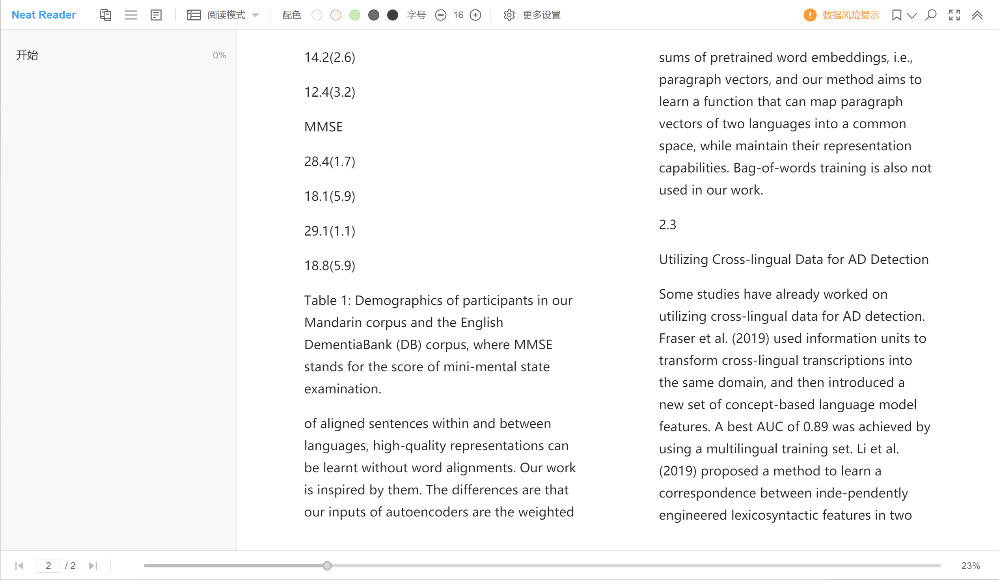

# 前言

对于一个研究生而言，阅读论文是一件必不可少的工作。如果使用电脑屏幕读论文，过不了多久眼睛就不舒服了。

这时，闲置已久的电纸书就派上用场了——类似纸质的阅读体验能够极好地改善眼睛盯着电脑屏幕带来的不适感。

但是又产生了新的问题：论文都是PDF格式的，而电纸书的尺寸往往在6-8英寸之间，如果直接阅读原文件，根本无法看清论文上的字。

我尝试将PDF转换成epub格式，然而由于论文的存在脚注、双行排版等问题，转换后的阅读体验十分糟糕，表格与图片的显示更是一塌糊涂。

试了许久之后，我最终找到一个完美的解决方案：那就是将PDF页面裁切成多个小块，然后再在电纸书上进行阅读。整个过程无需我们手动裁切，可以使用开源软件K2pdfopt完成。

> 当然了，更完美的解决方案是买一个墨水屏平板，或者干脆上墨水屏显示器。这是属于钞能力者的解决方案，本文不予讨论。

# K2pdfopt

## 下载

在[官网](https://willus.com/k2pdfopt/)点击Download，在左侧输入3位数字验证码后即可下载K2pdfopt。

## 使用

1. 软件的使用十分简单，将需要转换的文件拖拽左上角的白色方框即可。
2. 点击右下角的Preview可以预览裁切后的效果。
3. 如果觉得没有问题，点击左下角的Convert All Files即可转换。转换文件的默认保存路径与源文件相同，也可在Output Folder处自行指定。

## 其他

默认的转换效果左右没有留出边距，可以手动减小宽度，使裁切页面变窄，这样在阅读时就多出了一定空隙。

## 效果

笔者的墨水屏平板是小米的多看电纸书Pro，7.8英寸大小，实测转换后的显示效果如下：

